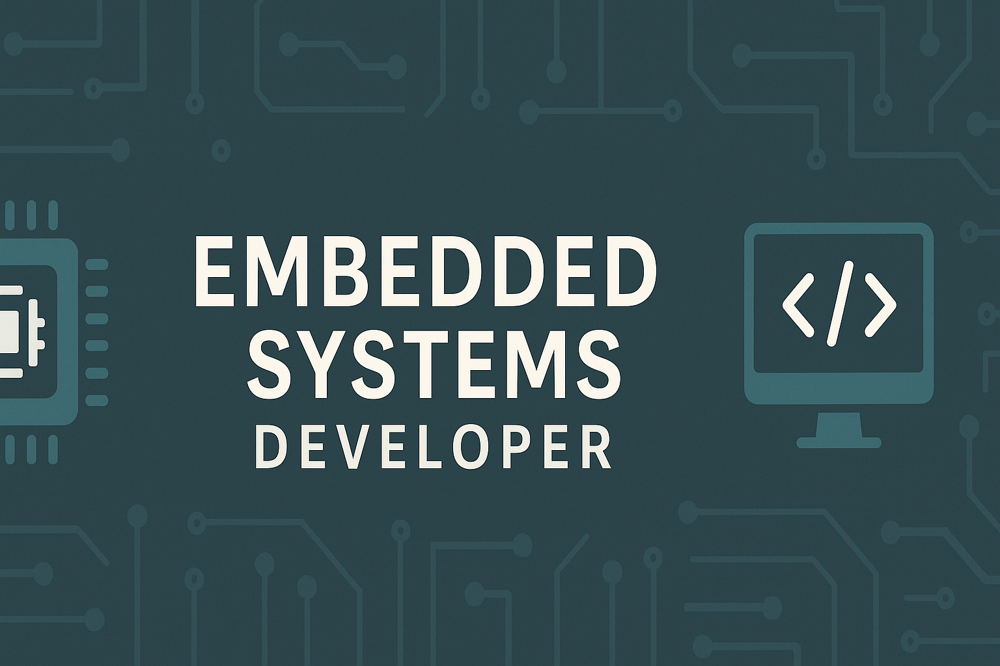

## Hi there, I'm Mohamed Khaled \U0001F44B

I'm an embedded systems and C/C++ developer with a passion for data structures, problem solving, modern C++ and hardware simulation. I enjoy building low level drivers, working on problem sets, and exploring new technologies.

- 🔧 Experienced in C, C++, and embedded systems development (UART, microcontrollers)
- 📓 Skilled in data structures, algorithms, and problem solving
- 🧪 Enjoy working on simulation projects using Verilog and C++
- 🌍 Based in Cairo, Egypt
- 📖 Currently learning Go and modern C++

### 📌 Projects worth checking out

- **UART Receiver Simulation with Verilator** – Full simulation of a UART receiver in Verilog/C++, reading real UART data.
- **Embedded”online”Diploma** – Collection of assignments and projects from an embedded systems diploma.
- **Data”Structure_PS** – Solutions to data structure problems in C.
- **ModernCpp** – Experiments with modern C++ features and idioms.
- **Problem_Solving** – Practice problems and algorithm implementations.

### 📈 GitHub stats

### 🤝 Get in touch

You can reach me via LinkedIn or explore more of my work here on GitHub. I'm always open to collaboration and learning opportunities.
